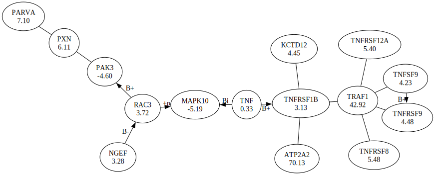

# Introduction

**GXNA (Gene eXpression Network Analysis)** is a method for analyzing gene expression data
using interaction networks. Below is an informal guide to the algorithm and the software
that implements it. For more background and technical details,
see this [paper](https://serbannacu.github.io/gxna/doc/bioinformatics.pdf).

A standard goal of gene expression experiments is to find genes associated with a
biological process or disease. Multiple samples are obtained, and gene expression
for each sample is measured for a large number of genes using a high throughput technology
like [microarrays](https://en.wikipedia.org/wiki/DNA_microarray)
or [RNA-Seq](https://en.wikipedia.org/wiki/RNA-Seq).
For each gene, a differential expression score is computed.
For example, in a cancer experiment, the gene score could be the
[*t*-statistic](https://en.wikipedia.org/wiki/Welch%27s_t-test)
that compares its expression values in tumor vs. normal samples.
Genes that are highly expressed or inhibited in cancer can be further
investigated as therapeutic targets.

However, in real organisms, one gene rarely acts in isolation.
Processes typically involve many genes, acting as part of biological pathways,
and an immense amount of work has gone into understanding these pathways.
GXNA integrates this knowledge and the expression measurements,
increasing statistical power and finding targets that are not detected by
single-gene analysis.

# Algorithm

## Interaction Data

GXNA represents prior biological knowledge as a (sparse) graph, with nodes corresponding to genes
and edges to known interactions.
The graph is undirected, even though the original interaction data
may be directed (e.g. one gene activates another).
Interaction type and direction are only used for displaying results,
and play no role in the algorithm.

Two public databases, NIH [Gene](https://www.ncbi.nlm.nih.gov/gene)
and [KEGG](https://www.genome.jp/kegg), were used to
generate interaction graphs for human and mouse genes,
included with the software. Users can also create their own graphs.

## Subgraph Search

Given the interaction graph and a gene expression data set, the algorithm searches for
small connected subgraphs (clusters of interacting genes) that are differentially expressed.
There are two ways to select the subgraphs:
- **Ball search**. Subgraphs are spheres of fixed radius *R* centered at some root node
(*R* = 0 is the same as single gene analysis).
- **Adapted search**. Given a root node, the subgraph is constructed by greedy search.
At each step the adjacent node with the highest score is added, until a fixed size is reached
or the subgraph score cannot be increased further.
The adapted search tends to perform better in practice. Any gene can be a root,
subject to some filtering rules and heuristics to reduce subgraph overlap.

## Statistical Significance

The massively parallel nature of the data leads to large numbers of gene or gene set candidates,
and requires statistical adjustments to avoid false positives due to random noise. A standard approach
for single-gene analysis is to control the [FWER](https://en.wikipedia.org/wiki/Family-wise_error_rate)
(family-wise error rate) using [permutation](https://en.wikipedia.org/wiki/Permutation_test) methods.
GXNA adapts this in the context of the subgraph search algorithm to compute statistical significance
(p-values) for gene clusters, adjusted for testing multiple hypotheses.

This is made possible by the efficient implementation of the subgraph search.
In a typical run on human data searching for clusters of 20 genes
with 5,000 roots and 1,000 permutations, the algorithm needs to perform
5,000,000 searches and completes in less than 10 seconds on consumer hardware.

# Installation

Download the code with `git clone https://github.com/serbannacu/gxna.git` (or via the web interface).
Inside the repo directory, run `cmake -S . -B build` followed by `cmake --build build`.
This will build the binary `build/gxna`.

If [cmake](https://cmake.org/download) is not available on your system,
you can also try to build with `make -f makefile.unix`.
This should work on Unix-like systems like Linux and MacOS.
Make sure `gcc` is installed and it supports C++17.

GXNA uses [Graphviz](https://www.graphviz.org) to draw graphs.
Run `neato -V` to check if it is already installed on your system.
If not, install it or GXNA will only be able to produce text output.

# Quick Start

## Input

All input files are standard text, with columns separated by spaces.
Reference data resides in the [`refdata`](refdata) directory and includes interaction graph files
such as `human.gra` and `mouse.gra`. Each microarray platform has a
[probe annotation file](#probe-annotation-files)
that maps each probe ID to its corresponding gene; multiple probes can map to the same gene.
Genes are referenced by their numeric GeneID from the NCBI Gene database.

Experiment data resides in the [`expdata`](expdata) directory.
Each experiment needs at least two files: a `.phe` file containing the
sample phenotypes, and a `.exp` file containing expression data, one line per probe.
Each line starts with the probe ID, followed by expression values (one per sample).

Phenotypes can be any string.

## Examples

First, run
```
build/gxna -name test -probeFile human1av2.ann
```
Both parameters are required. They tell the program to read experiment data from
[`test.phe`](expdata/test.phe) and `test.exp`
(simulated data included in the repo) and use the probe
annotation file `human1av2.ann` for the Agilent Human 1A Version 2 microarray.

Results are be written into the
`output/test/000/` directory. The string `000` can be changed with `-version`. It makes it easy to run GXNA multiple times
with various parameters and store the results in separate directories.
Among the output files, `index.html` is the most human friendly; open it in your browser of choice.

The left panel has a list of gene clusters
and their roots, ranked in order of their *p*-values (adjusted for multiple testing).
Clicking on any of the top clusters gives more details in the right panel.
Running the program with default parameters performs single-gene analysis, so all clusters consist of their root and have size 1.

For something more interesting, run
```
build/gxna -name test -probeFile human1av2.ann -version 001 -algoType GXNA
```
The output files are now in `output/test/001/`.
The `-algoType GXNA` parameter directs the program to perform an adapted search.
The clusters in the left panel now have size 15 (the default search depth).
The right panel has the list of genes in each cluster.
For each gene, it gives name, geneID, number of probes that map to it,
standard deviation of expression (over all samples), and score (in this case, the *t*-statistic).

You may notice there are gaps in the ranks of the top clusters. This is because some of these have many genes in common,
and by default GXNA does not display clusters that overlap more than 75% with higher scoring ones.

If Graphviz is installed, adding `-draw true` to the command line will render the top clusters into SVG files.
If you refresh the browser, the right panel should now show drawings like
the image below.



Each node displays the gene name and score, and each edge has the
interaction [type](#interaction-types) and direction (if known).

## Output

In the output directory, `parameters.txt` logs the program parameters, while
`index.html` and `results.txt` contain the results.
The latter has one line for each cluster/root, and after the regular columns
(of which the $p$-values are the last ones) also shows the list of genes in the cluster.

For each of the top clusters/subgraphs, GXNA also generates files `graph_N.{ext}`
where *N* is the rank of the cluster, and the
extension `{ext}` can be `txt`, `dot`, or `svg` (if `-draw` is enabled).
DOT files are generated even if Graphviz is not installed,
and can be used to create drawings later.

## Additional Notes

- Microarray data usually requires preprocessing / normalization, which can be done in packages such as
[Bioconductor](https://www.bioconductor.org).
- Input expression data for GXNA should ideally be normalized (e.g. *M*-values from Bioconductor).
If raw values are used, simple normalization by taking logarithms is recommended.
- If there are multiple probes for a gene, their expression values are averaged.
- Missing values in expression data are not yet supported. Probes with missing values should be excluded from the expression file,
or as a coarse workaround, these values can be set to zero.
- The score of an individual gene is its *t*-statistic (unequal variances)
if there are only two phenotypes, and ANOVA *F*-statistic
(converted to a *z*-score) if there are three or more phenotypes.
- The default score of a cluster is the sum of the scores of its genes,
scaled according to the size of the cluster. The scaling
only matters when comparing clusters of different sizes.

# Reference

## Parameters

Parameters can be set with command-line arguments such as `-draw true`.
They can also be read from a file, with each line consisting of a name
and a value e.g. `draw true` (no dash).

If `<name>` is the experiment name and the file
`expdata/<name>.arg` exists, it will be read automatically. Another file can be specified on the command line with
`-argFile <filename>`. This can be used to effectively change parameter default values.

Boolean values can be set in various ways: `True`, `T`, `true` and `1` are all equivalent.

Below is a description of the most useful parameters. See the source code for a complete list.
- `name`: the experiment name is part of the input filenames and output path.
- `version`: the version is part of the output path.
- `interactionFile`: gene interaction filename (default: `human.gra`).
- `probeFile`: probe annotation filename.
- `algoType`: `Basic` (default) for ball search, `GXNA` for adapted search.
- `radius`: ball radius for ball search.
- `depth`: maximum cluster size for adapted search. Default is 15, recommended value between 5 and 25.
- `flexSize`: if true, adapted search may stop before reaching maximum size.
- `minSD`: only use root genes with standard deviation above this threshold.
- `nPerms`: number of permutations used to compute *p*-values. Default is 100, which is reasonable for exploratory analyses; 1000 or 10000 recommended for definitive estimates.
- `shrink`: adjust scores via empirical Bayes shrinkage (moderated *t* and *F* statistics).
See the paper by [Smyth (2004)](https://gksmyth.github.io/pubs/ebayes.pdf) for details.
- `nRows`: maximum number of clusters to show in the HTML output.
- `nDetailed`: maximum number of clusters to write/draw detailed data.
- `maxOverlap`: hide clusters that overlap above this threshold with higher scoring clusters. Default is 0.75. Setting to 1 will show
everything in the HTML output but likely produce many redundant clusters.
- `draw`: use Graphviz to render graphs in SVG format.

## Probe Annotation Files

The following microarray annotation files are included:

```
hu6800.ann      Affymetrix Human 6800
hgu95av2.ann    Affymetrix Human U95
hgu133.ann      Affymetrix Human 133 (also works for 133A and 133B)
human1av2.ann   Agilent Human 1A Version 2
whg.ann         Agilent Whole Human Genome
wmg.ann         Agilent Whole Mouse Genome
```

## Interaction Types

Each line in the interaction file has the following format: `<gene1> <gene2> [type [source]]`, with the last two fields optional.
In the files included in the repo, the source is either a database name or a KEGG pathway number.
The interaction types are listed below. If the type is missing, it is likely a protein-to-protein interaction.

```
E   enzymatic
T   transcription
    T+  activation
    T-  inhibition
B   protein to protein binding
    Bc  compound
    B+  activation
    B-  inhibition
    Bi  indirect effect
    Bs  state change
p+  phosphorylation
p-  dephosphorylation
m   methylation
u   ubiquitination
g   glycosylation
```
